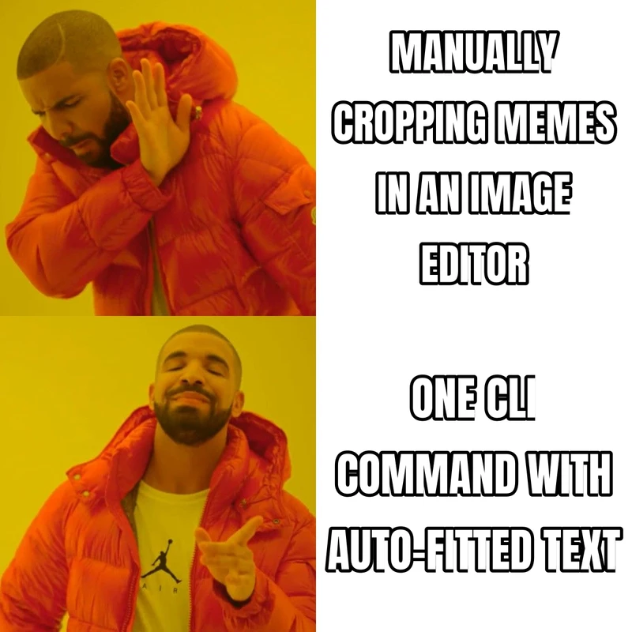
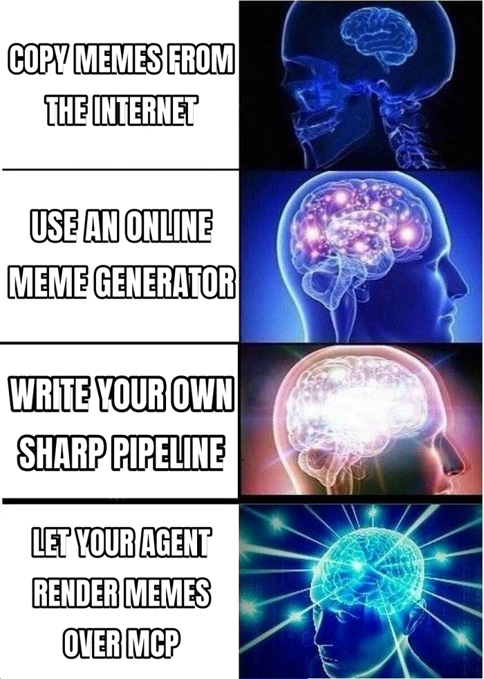
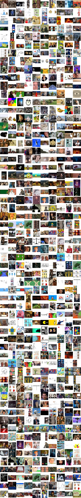
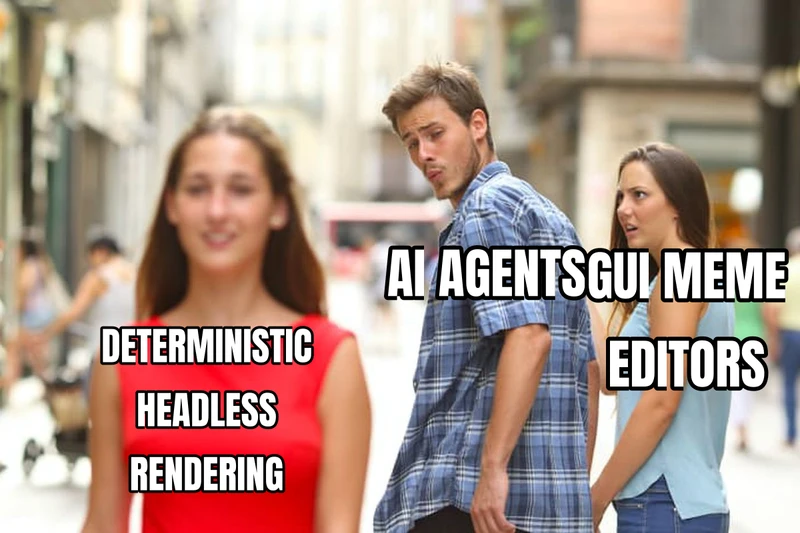
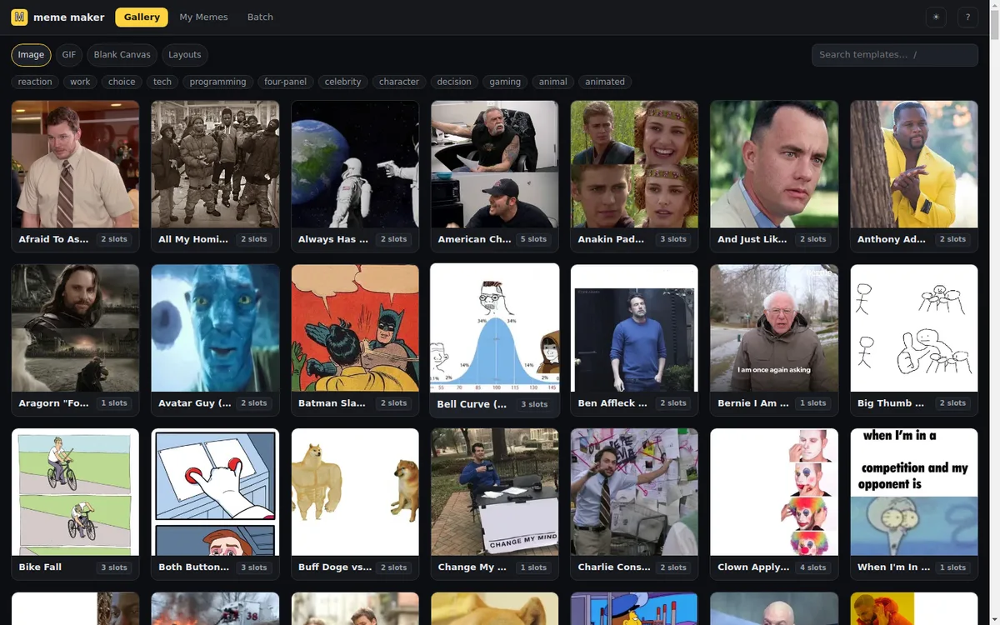
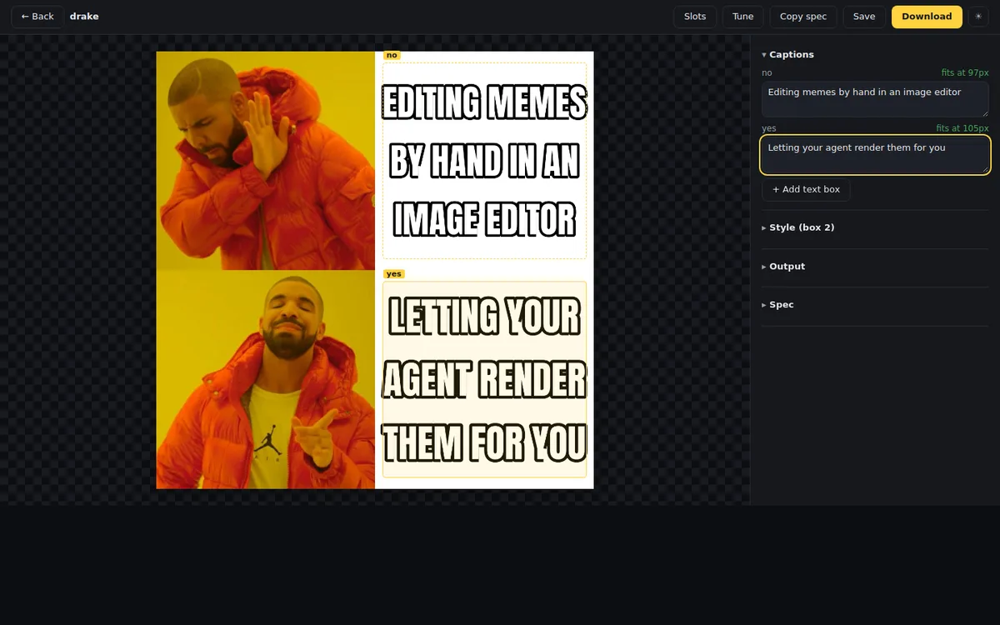
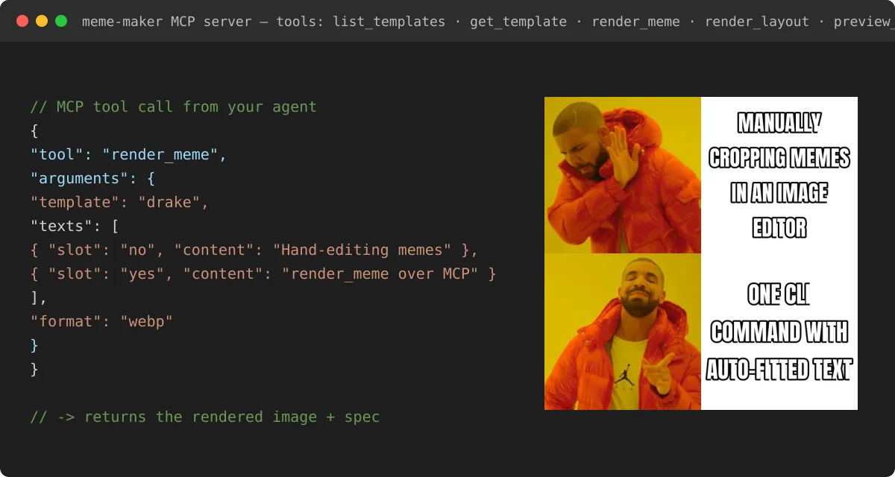

# meme-maker

A meme editor built for **agents**, not humans. Premade image/GIF meme templates plus a deterministic text-overlay engine, driven through a CLI, an MCP server, and a local web UI — no cloud, no accounts.

Inspired by the SupaBird.io "Meme Maker" tool, re-imagined for autonomous agent workflows.



## 60-second quick start

```sh
npm i -g agent-meme-maker        # installs the `meme` and `meme-maker-mcp` binaries
# or run without installing:
npx agent-meme-maker templates list

meme templates list                                   # browse the catalog
meme render --template drake \
  --text no="MANUAL MEME EDITORS" --text yes="A CLI FOR AGENTS" -o out.png
```

That's it — `out.png` is a finished meme. Add `--json` to any command for machine-readable output.



From a clone instead: `npm install && npm run build`, then use `node dist/cli.js` wherever you see `meme`.

## Templates

118 templates ship in the catalog: 103 static images (drake, distracted-boyfriend, expanding-brain, woman-yelling-at-cat, afraid-to-ask-andy, doge, red-pill-blue-pill, scroll-of-truth, ...) and 15 animated GIFs (mind-blown, deal-with-it, crab-rave, confused-travolta, shrek-running, ...). Provenance for every template is tracked in [assets/templates/CREDITS.md](assets/templates/CREDITS.md).



Any thumbnails can also be composed into montages with `meme layout`:


The manifest is generated: each template's metadata lives in a `<id>.meta.json` sidecar next to its media file, and `npm run build:manifest` scans `assets/templates/**`, derives file paths and dimensions, validates against the schema, and emits `manifest.json`. `npm run build:thumbs` renders ~320 px webp previews into `assets/templates/thumbs/` plus the contact sheet above.

```sh
meme templates list --json          # full catalog with slots & tags
meme templates show drake --json    # slot rects + hints for one template
```

Each template declares named text slots (e.g. drake has `no` and `yes`) with hints describing what goes where. Non-template bases (canvas, image, layout) accept the convenience slots `top`, `middle`, and `bottom`.

## CLI

```sh
# browse the catalog
meme templates list --json
meme templates show drake

# classic meme in one line
meme render --template drake \
  --text no="MANUAL MEME EDITORS" --text yes="A CLI FOR AGENTS" \
  -o drake.png --json

# blank canvas / custom image / grid layout
meme render --canvas 800x600 --bg '#1e3a5f' --text "HELLO AGENTS" -o hello.png
meme render --image photo.jpg --text "CAPTION" -o captioned.png
meme layout --grid 2x2 --cell a.jpg --cell b.jpg --cell c.jpg --cell d.jpg -o grid.png

# full MemeSpec for advanced styling
meme spec render examples/drake.json

meme fonts list
```



All commands accept `--json` for machine-readable output and `--strict` to treat degraded-render warnings (text overflow, missing glyphs) as errors. Errors are emitted as `{ "error": { "code", "message" } }` with exit code 1.

## Web UI

```sh
meme ui              # starts the local web app; auto-picks a free port
meme ui --port 8787  # or pin one
```

The first stdout line is machine-readable JSON — `{"url":"http://127.0.0.1:PORT"}` — so hosts and agents can discover the URL; a human-readable line follows on stderr. The SPA has four surfaces:

- **Gallery** — browse/search all 118 templates with thumbnails
- **Editor** — pick a template, fill slots, live preview, tune slot rects
- **My memes** — render history (stored under `~/.meme-maker/history`, override with `MEME_HISTORY_DIR`)
- **Batch** — render one template with many text variants at once





The same server exposes a JSON API (`/api/templates`, `/api/templates/:id`, `/api/measure`, `/api/render`, `/api/history`). See [docs/UI-DESIGN.md](docs/UI-DESIGN.md) for the full UI/UX spec.

## MCP server

Stdio transport, five tools: `list_templates`, `get_template`, `render_meme`, `render_layout`, `preview_template`.



Claude Desktop / any `mcpServers`-style host (`claude_desktop_config.json`):

```json
{
  "mcpServers": {
    "meme-maker": { "command": "meme-maker-mcp" }
  }
}
```

Codex (`~/.codex/config.toml`):

```toml
[mcp_servers.meme-maker]
command = "meme-maker-mcp"
```

ACP hosts (e.g. Synara): register `meme-maker-mcp` as a stdio MCP server in the agent's MCP configuration; rendered files land under the output root (`SYNARA_ARTIFACTS_DIR` is respected automatically).

If installed from a clone rather than npm, use `"command": "node", "args": ["/path/to/meme-maker/dist/mcp.js"]`.

`render_meme` takes a full `MemeSpec` and returns the rendered image inline (≤ 1 MB) plus the file path when `output.path` is given.

## Environment variables

| Variable | Default | Purpose |
| --- | --- | --- |
| `MEME_OUTPUT_ROOT` | `./.memes` | Root directory outputs are confined to on MCP/HTTP surfaces (`SYNARA_ARTIFACTS_DIR` is used if set) |
| `MEME_INPUT_ROOT` | cwd | Root directory input images must resolve under on MCP/HTTP surfaces |
| `MEME_ALLOW_FS` | unset | Set to `1` to allow filesystem image reads on MCP/HTTP surfaces |
| `MEME_TEMPLATES_DIR` | bundled assets | Use a custom template catalog (also `--templates-dir`) |
| `MEME_HISTORY_DIR` | `~/.meme-maker/history` | Where `meme ui` stores render history |
| `MEME_MAX_PIXELS`, `MEME_MAX_INPUT_BYTES`, `MEME_MAX_GIF_FRAMES`, `MEME_MAX_TEXT_LEN`, `MEME_MAX_TOTAL_TEXT_LEN`, `MEME_RENDER_TIMEOUT_MS`, `MEME_MAX_CONCURRENCY` | sane limits | Resource caps for untrusted inputs |

## MemeSpec for agents

Everything renders from one declarative JSON spec — ideal for programmatic generation (see [examples/](examples/)):

```json
{
  "base": { "kind": "template", "id": "drake" },
  "texts": [
    { "slot": "no", "text": "MANUAL MEME EDITORS" },
    { "slot": "yes", "text": "A CLI FOR AGENTS" }
  ],
  "output": { "path": "drake.png", "format": "png" }
}
```

Render it with `meme spec render examples/drake.json` or pass the same shape to the `render_meme` MCP tool.

## Library

```ts
import { listTemplates, getTemplate, renderMeme } from 'agent-meme-maker';

const out = await renderMeme({
  base: { kind: 'template', id: 'drake' },
  texts: [
    { slot: 'no', text: 'MANUAL EDITORS' },
    { slot: 'yes', text: 'AGENT CLIS' },
  ],
  output: { path: 'out.png' },
});
```

## Development

```sh
npm run build   # tsc + vite (web UI)
npm test        # vitest (unit + golden-image + MCP + HTTP integration)
npm run lint    # eslint + prettier + ui typecheck
```

See [DESIGN.md](DESIGN.md) and [docs/DESIGN-v2.md](docs/DESIGN-v2.md) for the full design, [docs/CONTRIBUTING.md](docs/CONTRIBUTING.md) for catalog workflows, and [docs/ROADMAP.md](docs/ROADMAP.md) for what's next. Template provenance is documented per-entry in `assets/templates/manifest.json` and in [NOTICE](NOTICE).

## Fonts

Text is rendered with a per-codepoint fallback chain via [opentype.js](https://github.com/opentypejs/opentype.js): [Anton](https://fonts.google.com/specimen/Anton) (display) → [Noto Sans](https://fonts.google.com/noto/specimen/Noto+Sans) → [Noto Emoji](https://fonts.google.com/noto/specimen/Noto+Emoji) (monochrome). All bundled fonts are licensed under the SIL Open Font License 1.1 (see `assets/fonts/OFL-*.txt` and [NOTICE](NOTICE)).
